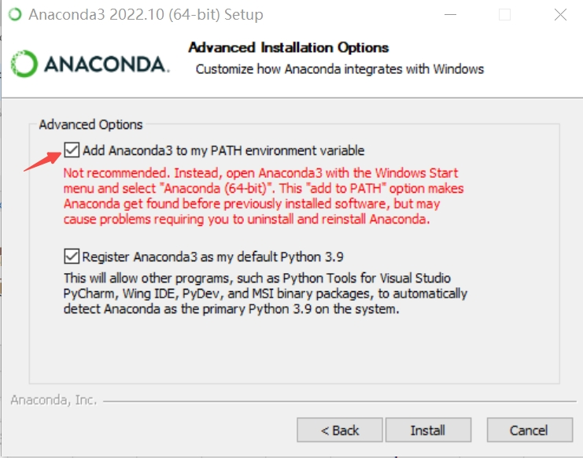
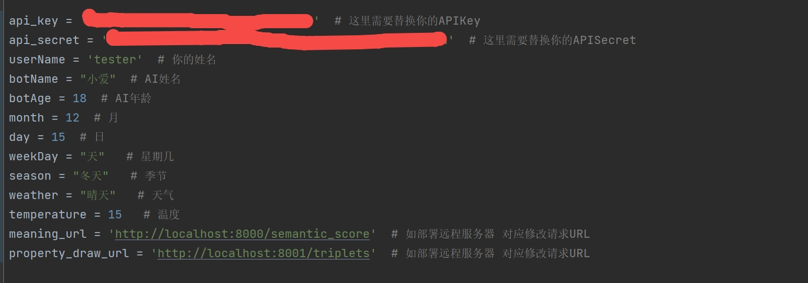

# SkyChat
### [简体中文](README.CN.md)
### [English](README.md)
## General
### SkyChat is a Chat-Bot project based on Chinese GPT3 API. More details at [SingularityAI-OpenAPI](https://openapi.singularity-ai.com)

# How to use the Demo：
## Set up model and python environment  
## Windows
1. Download [Anaconda](https://www.anaconda.com/) , and select add to path  
      
2. Download and unzip the models and training data [semantic_score_clean](http://open-dialogue.singularity-ai.com/open_dialogue/share_model/semantic_score_clean.zip) and [user_profile_clean](http://open-dialogue.singularity-ai.com/open_dialogue/share_model/user_profile_clean.zip)   
3. Open an Anaconda prompt and type in the commands   
      `conda create -n semantic` create new env  
      `conda info --envs` check environments  
      `activate semantic` activate it    
      `cd [YOUR PATH]\semantic_score_clean\semantic_score_clean` navigate to the extracted 'semantic_score_clean' folder    
      `python -m pip uninstall numpy` Delete the default numpy  
      `python -m pip install -r requirements.txt`  Install Requirements   
      `python semantic_score_api.py` Bring semantic service online
4. [Download Cuda according to your system and install](https://developer.nvidia.com/cuda-downloads)
5. Open a new anaconda prompt and type in the following 
   `conda create -n userprofile`create new env   
   `conda info --envs`check environments    
   `activate userprofile`activate it  
   `cd [YOUR PATH]\user_profile_clean\user_profile_clean` navigate to the extracted 'user_profile_clean' folder  
   `python -m pip uninstall numpy`  Delete the default numpy   
   `python -m pip install -r requirements.txt` Install Requirements    
   `python -m pip install torch==1.11.0+cu115 -f https://download.pytorch.org/whl/torch_stable.html` Download torch in cuda version      
   `python server_v3.py`Bring userprofile service online  

***
## Unity Demo
1.  Download the newest release
2.  Register [In OpenAPI website](https://openapi.singularity-ai.com/index.html#/login) or inside the Demo to get 'api-key' and 'api-secret'
3.  Click Setting, inside the setting panel, type in key and secret accordingly, customize the names in your need, click save and exit  
4.  Make sure 'semantic_score_clean' and 'user_profile_clean' has been set up locally, if you want to set it up remotely, replace the url to your remote host  
5.  Time to chat!
***
## Python Demo
1. Register [In OpenAPI website](https://openapi.singularity-ai.com/index.html#/login) to get 'api-key' and 'api-secret'  
2. Open `\[YOUR PATH]\OpenAPIDemo\PythonDemo\main.py` fill in key and secret accordingly 
   
3. Open Anaconda and type in the following 
    `conda create -n talk` create new env    
    `activate talk` activate it  
   `cd \[YOUR PATH]\OpenAPIDemo\PythonDemo` navigate to your Demo path  
    `python -m pip install requests` Install requirements  
    `python main.py` Begin to chat（Make sure 'Semantic' and 'UserProfile' services has been set up）  
***
##### * Minimum requirement Nvidia Gfx 1060
